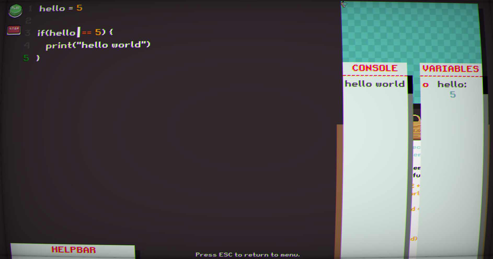
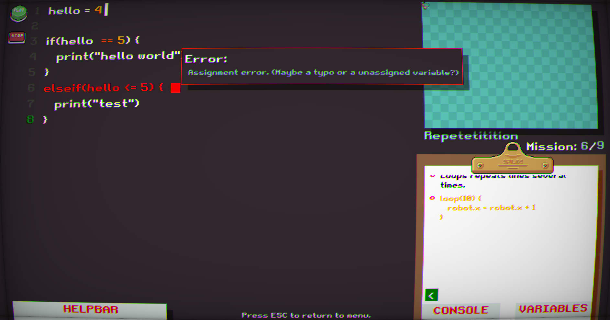

# robot.r

Puzzle game written for a internship. Inspired by [Sebastian Lague's](https://www.youtube.com/watch?v=dY6jR52fFWo) project. This repo is a mess, please ignore.

# Building

Build with the solution file.

# Game loop

The game consists of 9 challenges, which the player shall solve using the built-in programming language. Challenges range from assigning a variable to constructing loops. 

The program controls a _robot_, which in later challenges, must be controlled to pick up coins on the _playground_ (the board on the top right of the screen) 

# plang
The scuffed "Programming language" I've made for the game. I've named it plang. Indentation in the programming language does not matter whatsoever, it's not Python.

## Memory 
All variables are technically doubles (floats). But all variables can be used as integers also. All variables are internally stored in a dictionary of <strings as keys, doubles as values>.
All variables have GET and SET properties.

For example:
```
helloworld = 5
```
(Since the language is scuffed, spaces between = are **very important**)
    
## Built in functions
- Square root, sqrt(arguments)
- Sin, sin(arguments)
- Cos, cos(arguments)
- Tan, tan(arguments)

## Built in methods
- print (arguments, arguments, ...), prints things to the console, can print variables, expressions and strings at the same time (split by commas). 
- sleep(expressions), adds delay. Useful to see control flow.

## Expressions
Expressions within and outside parentheses are split with spaces. Outside parentheses expressions might work without a space, but not inside.
Recursive arguments work. For example: foo = sqrt(sqrt(sqrt(20))) is a valid argument.

## Conditional statements
Conditional statements check arguments within parentheses and returns true or false, according to the arguments. If true, runs lines within the curly brackets { }.
- if(arguments)
- elseif(arguments), only runs conditional argument if all other "if" and "elseif" statements were false.
- else(arguments), only runs if all other "if" and "elseif" were false.

### Logical operators
- ||, the OR operator checks if 2 or more arguments are true, if ANY of them are true, return true for the entire segment.
- &&, the AND operator splits an statement into 2 "segments", then checks if BOTH of the "segments" return true. These "segments" can contain OR operators as in the DEMO below.
    
## Operators
- == (Equals)
- != (Does not equal)
- < (Smaller than)
- > (Bigger than)

## Loops
### loop(expressions)
Loops repeat the lines within the curly brackets as many times as argued.
For example:
```
loop(20) {
    robot.x = robot.x + 1
}
```

### while(conditions)
While loops repeat the lines as long as a conditional statement is true.
For example:
```
while(robot.x < 10) {
    robot.x = robot.x + 1
}
```

## Built-in classes 
For the puzzles, one built-in class is implemented. Built-classes members have a GET and SET property.

### robot, controls the robot (player) on the playground.
- x, x cordinate of the robot.
- y, y cordinate of the robot.

For example: 
```
robot.x = 5
test = robot.y
```

# Gallery


